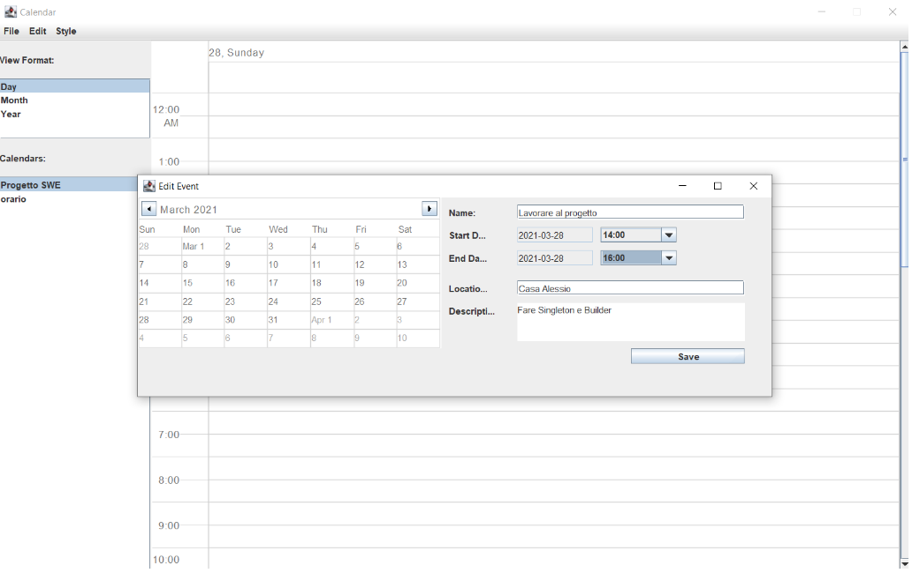
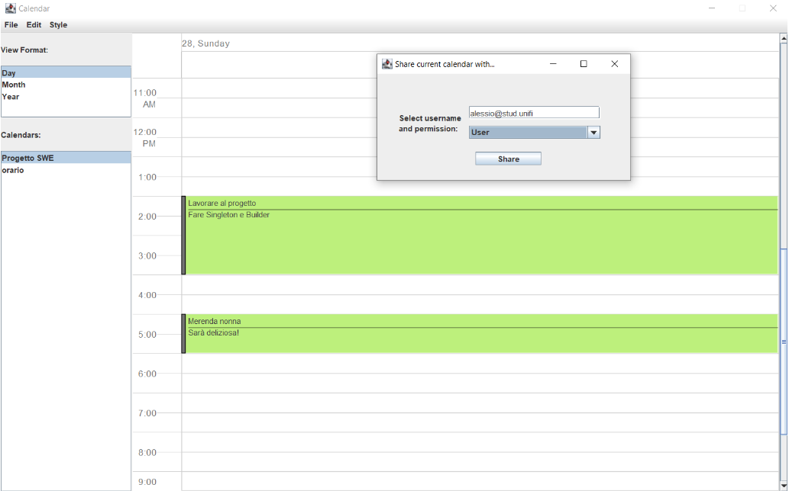

# Shared Calendar Application

This repository contains the report and Java project for the Shared Calendar Application, developed as the final project for the Software Engineering exam at the University of Florence. 

## Statement
Our application aims to create a secure and efficient system of shared calendars. Each calendar has an owner and can be shared with other users, who can modify it based on their recognized permissions. Users access their calendars through an authentication system. The calendar management interface allows users to create, modify, and delete events.

Each event is characterized by various attributes, such as name, description, location, and date. User interaction with the calendar is facilitated through a graphical interface that enables them to view events by day, week, or month. Users can search for events by name and location, among past and scheduled events.

A notification system has been implemented to alert users about scheduled events on the same day. Calendar sharing operates in such a way that a user can choose to share a calendar they own with others.

## UI
### Event creation

    

 

### Calendar display and sharing

    

## Use Case
In applications with various Use Cases, it is advisable to separate User Goal Use Cases from Function Use Cases. It is preferable for the names of the Use Cases presented in the diagram to start with a lowercase letter. It is also useful to number the Use Cases, especially when making references in MockUps.

For applications that involve a login phase, it is helpful to indicate the Use Case related to data access with the _'summary'_ stereotype.

## Database
The implemented approach is not a class mapping to a database, but rather something more akin to persisting data represented by classes in a database. In general, mapping is preferred in similar applications.

It is useful, during the design phase, to start from the class diagram and then automatically generate tables, effectively creating a mapping.

There are application solutions that allow efficient handling of mapping and persistence, such as Java Enterprise JPA, which offers, among other things, the ability to manage the transient phase of data transfer to the database (like the UUID mechanism, a standard implementation for managing primary keys). Another important solution is Hibernate.

Gateways are often also identified as DAO (Data Access Object), which can be multiple in an application to manage objects of different types.

## Tests
A tool that can be useful for testing the graphical interface in Black Box mode is Selenium. In general, the fundamental step is to divide the software into small units to test independently. Especially when dealing with a database, it is good practice for each query to be tested.

## Other Considerations
As the complexity of the graphical interface grows, especially when a window navigation diagram is available, it is useful to create a controller for each page. This choice must naturally be accompanied by a control transfer mechanism from controller to controller.

